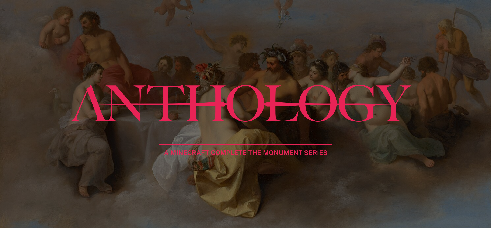

# Anthology CTM

This repository is the archive for **Anthology**, a series of Complete the Monument (CTM) maps for modern Minecraft created by Joey Sweener. 

Evoking the classic feeling of CTM maps from Minecraft's heyday, Anthology focuses on dungeon-delving through intricately-built structures, and makes minimal but tasteful use of data- and resource-packs to provide unique gameplay mechanics without straying too far from core Minecraft experience.
